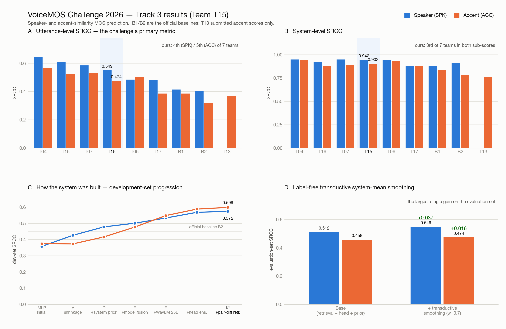
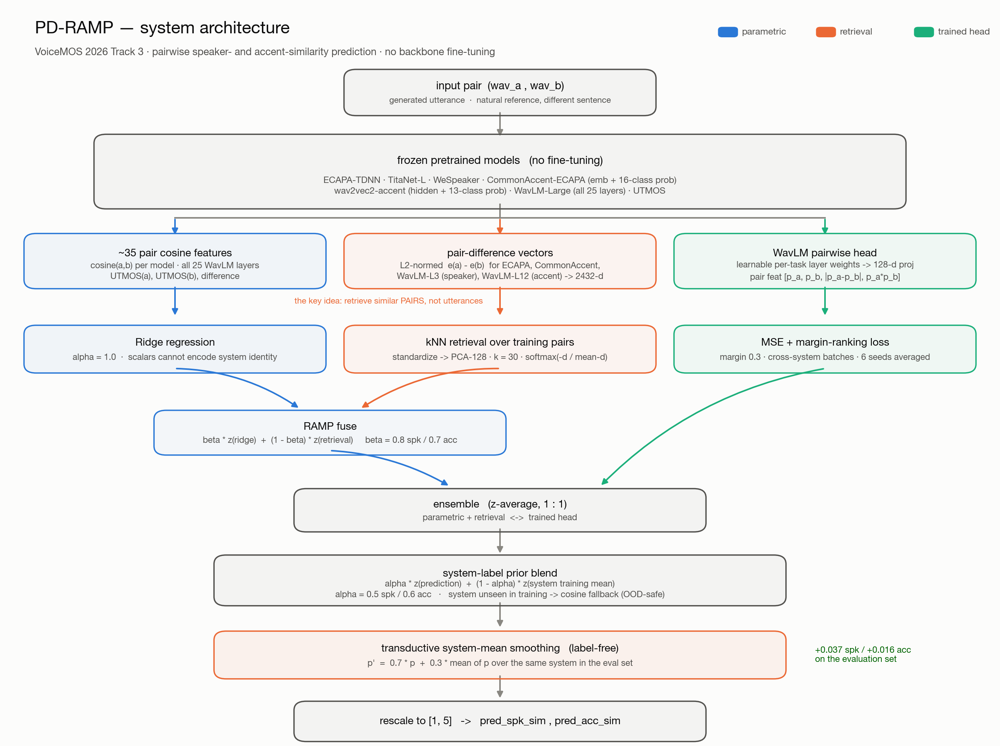

# VoiceMOS Challenge 2026 — Track 3

**Predicting speaker- and accent-similarity MOS for codec / TTS speech.**
Team **T15** (solo, independent) — *PD-RAMP: Pair-Difference Retrieval-Augmented MOS Prediction*.

> Given a generated utterance and a natural recording of the target speaker reading a
> **different sentence**, predict two utterance-level MOS scores in [1,5]:
> **speaker similarity** and **accent similarity**. Metric: utterance-level Spearman (SRCC).

---

## Results



**Official evaluation (7 teams + 2 baselines):**

| | Utterance-level (primary) | | System-level | |
|---|---|---|---|---|
| | **SPK** | **ACC** | **SPK** | **ACC** |
| **Ours (T15)** | **0.549** | **0.474** | **0.942** | **0.902** |
| rank | 4th | 5th | **3rd** | **3rd** |
| B1 — ECAPA cosine | 0.414 | 0.386 | 0.874 | 0.838 |
| B2 — ECAPA + head | 0.403 | 0.316 | 0.914 | 0.786 |
| Best team (T04) | 0.644 | 0.565 | 0.948 | 0.943 |

We beat the stronger official baseline by **+0.135 SPK / +0.088 ACC**, and place
**3rd of 7 at system level in both sub-scores** — within 0.006 of the top speaker score.
Full breakdown: **[results/README.md](results/README.md)**.

---

## Method



Frozen backbones only — no fine-tuning. Three pathways are fused, then corrected with
a system prior and a label-free smoothing step:

1. **Parametric** — ~35 pair cosine features (7 frozen models + all 25 WavLM layers + UTMOS) → ridge.
2. **Retrieval (the core idea)** — retrieve nearest **pairs** in the space of embedding
   *differences* (ECAPA, CommonAccent, WavLM-L3, WavLM-L12 → 2432-d → PCA-128, k=30).
   Retrieval in this rich space is what works; retrieval over the compact cosine
   scalars performs the same as ridge alone.
3. **Trained head** — WavLM with learnable per-task layer weights + pair interactions,
   MSE + margin-ranking loss over cross-system batches, 6 seeds. 164 K trainable params.
4. **System-label prior** with a **cosine fallback** for unseen systems (OOD-safe: a
   leave-one-system-out sweep to 90 % unseen shows it never hurts).
5. **Transductive system-mean smoothing** — `p' = 0.7·p + 0.3·mean_sys(p)`, label-free.
   **The largest single gain on the evaluation set: +0.037 SPK / +0.016 ACC.**

---

## Repository layout

| Path | What it is |
|---|---|
| **[`final_system/`](final_system/)** | **The system that produced the official result.** Feature extraction for the eval set, training on train+dev (3,400 pairs), prediction, and the smoothing post-process. |
| [`experiments/`](experiments/) | Every idea that was explored — kept for the record, including the ones that failed. |
| [`results/`](results/) | Official scores, the figures above, and the scripts that generate them. |
| [`docs/`](docs/) | [PAPER.md](docs/PAPER.md) (full technical reference), the [ICASSP paper](docs/paper/), the [system description](docs/system_description.md), research notes. |
| `eval_harness.py` | Grouped-CV-by-system validation harness (the gate every idea had to pass). |
| `metrics_voicemos.py` | Official metric implementation. |

### `final_system/` — what produced the 0.549 / 0.474

| File | Role |
|---|---|
| `eval_extract.py`, `eval_extract_rest.py` | Frozen-model feature extraction (GPU) |
| `eval_titanet_mac.py`, `eval_wespeaker_mac.py` | TitaNet / WeSpeaker extraction (local) |
| `make_eval_submission.py` | Trains on train+dev, predicts `test.csv` → `answer.txt` |
| `validate_improvements.py` | Grouped-CV validation of the smoothing and β re-tune |
| `apply_shrinkage.py` | Transductive system-mean smoothing post-process |

---

## Experiment log

Everything under `experiments/`, scored on the **development set** unless noted.
Each had to beat the previous under grouped CV before being submitted.

| | Idea | dev SPK | dev ACC | Verdict |
|---|---|---|---|---|
| — | TitaNet + MLP head (first attempt) | 0.358 | 0.375 | ✗ below baseline — learned system identity |
| A | System-mean shrinkage | 0.426 | 0.373 | ~ helps SPK only |
| B | Counterfactual accent≠speaker pairs | — | — | ✗ no gain (see below) |
| C | Codec degradation ladders | — | — | ✗ not adopted |
| D | Cosine fusion + **system-label prior** | 0.478 | 0.416 | ✓ beats B1 |
| E | + WeSpeaker / CommonAccent / UTMOS | 0.501 | 0.477 | ✓ beats B2 |
| F | + **all 25 WavLM-Large layers** | 0.533 | 0.548 | ✓ biggest accent jump |
| G | Multi-SSL 98-feature fusion | 0.526 | 0.541 | ✗ extra backbones dilute |
| H | Trained pairwise head (standalone) | 0.530 | 0.547 | ~ ≈ ridge alone |
| I | Ensemble F + head (1:1) | 0.568 | 0.588 | ✓ diversity helps |
| J | Listener-dependent modelling | 0.42 / 0.44 (CV) | | ✗ **hurts** — see below |
| K | RAMP retrieval, cosine space | 0.566 | 0.589 | ~ ≈ ridge |
| **K★** | **RAMP retrieval, embedding-difference space** | **0.575** | **0.599** | ★ **final system** |
| L | PPG accent features | +0.001 | | ✗ redundant |

### Retrieval-space ablation (grouped CV)

| Retrieval space | SPK | ACC |
|---|---|---|
| Ridge only | 0.644 | 0.598 |
| Cosine scalars (35-d) | 0.648 | 0.602 |
| **Embedding difference, 4 sources** | **0.665** | **0.630** |
| Embedding difference, per-target | 0.653 | 0.623 |
| Embedding difference, 9 sources | 0.659 | 0.621 |

Retrieval must happen in the **rich embedding space**; a shared space beats per-target
ones (the sub-scores correlate 0.86); and 4 well-chosen sources beat 9.

---

## What we learned (including what didn't work)

- **Validate by holding out whole systems.** A random split reported 0.63 for a model
  whose true dev score was 0.36. The grouped-CV harness was calibrated against the
  leaderboard (ECAPA cosine: 0.432 CV = 0.432 official) and predicted it reliably.
- **Listener-dependent modelling hurts here.** Training on all 13,687 listener-wise
  ratings with listener embeddings dropped CV SRCC to 0.42 / 0.44 vs 0.50+ from averaged
  labels. With only ~4.9 ratings/pair it reintroduces the noise averaging removes —
  contradicting prior listener-modelling claims.
- **Accent can't be decorrelated from speaker in this data.** Every pair is a
  same-speaker attempt, so "different speaker, same accent" never appears; manufactured
  counterfactual pairs gave no gain because the metric cannot reward decorrelation.
- **More SSL backbones dilute.** WavLM-Large alone beats stacking HuBERT/XLS-R/WavLM-Base.
- **The task has a low ceiling.** Listener std is 0.85–0.92 on a 5-point scale; a
  split-half estimate puts the attainable utterance-level correlation near 0.81 / 0.76.
- **Our weakness: calibration.** MSE ranked 7th — we optimised rank correlation and
  rescaled linearly, so the output is not a usable absolute MOS.

---

## Reproducing

```bash
pip install -r requirements.txt

# 1. extract frozen features for the evaluation set
python final_system/eval_extract.py       --wav_root <eval_root> --csv <test.csv> --out final_system/evalfeat
python final_system/eval_extract_rest.py  --wav_root <eval_root> --csv <test.csv> --out final_system/evalfeat
python final_system/eval_titanet_mac.py   # TitaNet   (local)
python final_system/eval_wespeaker_mac.py # WeSpeaker (needs HF_TOKEN; model is gated)

# 2. train on train+dev and predict the evaluation set
python final_system/make_eval_submission.py --out /abs/path/answer.txt

# 3. apply the transductive smoothing (this is the submitted system)
python final_system/apply_shrinkage.py

# 4. package  — the file inside the zip MUST be named answer.txt
cd final_system/submission_v2 && zip -j submission.zip answer.txt
```

> **CodaBench gotcha:** if the inner file is not exactly `answer.txt`, the submission
> "finishes with no score" and gives no error. This cost us several submissions.

## Documentation

- **[docs/PAPER.md](docs/PAPER.md)** — full technical reference: method, all stats, ablations, negatives
- **[docs/paper/](docs/paper/)** — ICASSP-format paper (LaTeX)
- **[docs/system_description.md](docs/system_description.md)** — challenge system-description questionnaire
- **[results/README.md](results/README.md)** — official scores in full

## Acknowledgements

Built on public pretrained models: SpeechBrain (ECAPA-TDNN), NVIDIA NeMo (TitaNet),
pyannote.audio (WeSpeaker), CommonAccent-ECAPA, WavLM-Large, UTMOS.
Retrieval design inspired by [RAMP](https://arxiv.org/abs/2308.16488).
Dataset: [CodecMOS-Accent](https://arxiv.org/abs/2603.14328), VoiceMOS Challenge 2026.
